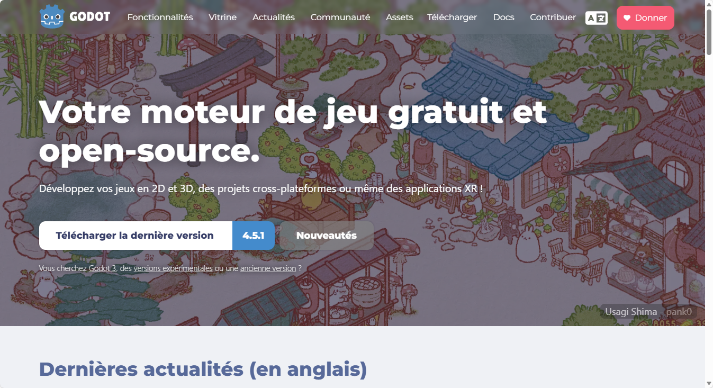
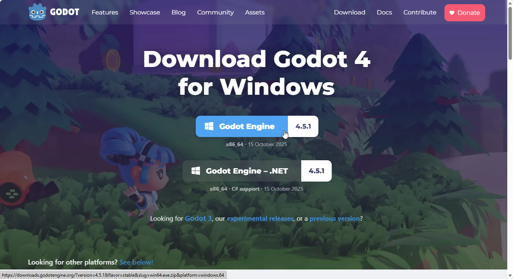
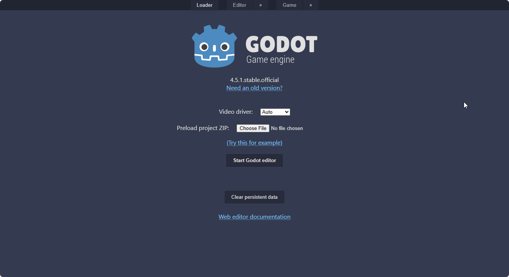

# Leçon 1 - Introduction à Godot

Bienvenue! Dans cette leçon, tu vas découvrir ce qu'est Godot et comment il peut t'aider à créer ton propre jeu vidéo.

## Qu'est-ce que Godot ?
Godot est un logiciel gratuit qui permet de créer des jeux vidéo facilement. Il fonctionne sur Windows, Mac et Linux. Pas besoin d'être un expert pour commencer!

## Pourquoi utiliser Godot ?
- Il est simple à utiliser, même pour les débutants.
- Il permet de créer des jeux en 2D et en 3D.
- Il est gratuit et open source.

## Installer et exécuter Godot
1. Va sur le site officiel : https://godotengine.org/
	
2. Télécharge la version la plus récente.
	
3. Vas dans ton dossier de téléchargements.
4. Trouve le fichier téléchargé (par exemple, `Godot_v4.5.1-stable_win64.exe`).
5. Clic-droit sur le fichier et sélectionne "Extraire tout...".
6. Appuie sur "Extraire" pour décompresser Godot dans un dossier.
7. Une nouvelle fenêtre s'ouvre avec le fichier du programme Godot.
8. Double-clique sur le fichier qui ressemble à `Godot_v4.4.1-stable_win64` pour lancer Godot.

### Alternative : Utiliser Godot en ligne
Si tu ne veux pas installer Godot, tu peux l'utiliser directement dans ton navigateur web : https://tinyurl.com/gd4web ou
 https://editor.godotengine.org/releases/latest/
	

## Créer ton premier projet

1. Ouvre Godot.
	<!-- Insère capture d'écran ici (page d'accueil Godot) -->
2. Pour mettre l'interface en français :
	- Clique sur le bouton "Settings" en haut à droite de la page d'accueil.
	  <!-- Insère capture d'écran ici (bouton Settings) -->
	- Sélectionne "Français" dans la liste des langues.
	  <!-- Insère capture d'écran ici (choix de la langue) -->
	- Clique sur "Restart now" pour redémarrer Godot et appliquer la langue.
	  <!-- Insère capture d'écran ici (bouton Restart now) -->
3. Clique sur "Créer".
	<!-- Insère capture d'écran ici (nouveau projet) -->
4. Donne un nom à ton projet (ex : Mon Premier Jeu).
	<!-- Insère capture d'écran ici (nom du projet) -->
5. Choisis un dossier où le sauvegarder.
	<!-- Insère capture d'écran ici (choix du dossier) -->
6. Sélectionne "Compatibilité" pour le moteur de rendu.
	<!-- Insère capture d'écran ici (choix du moteur de rendu) -->
7. Clique sur "Créer".
	<!-- Insère capture d'écran ici (bouton Créer) -->

Bravo ! Tu es prêt à commencer ton aventure de créateur de jeux.
Bravo! Tu es prêt à commencer ton aventure de créateur de jeux.

---
À la prochaine leçon, tu vas apprendre à préparer les images et sons pour ton jeu.
À la prochaine leçon, tu vas apprendre à préparer les images et sons pour ton jeu.
